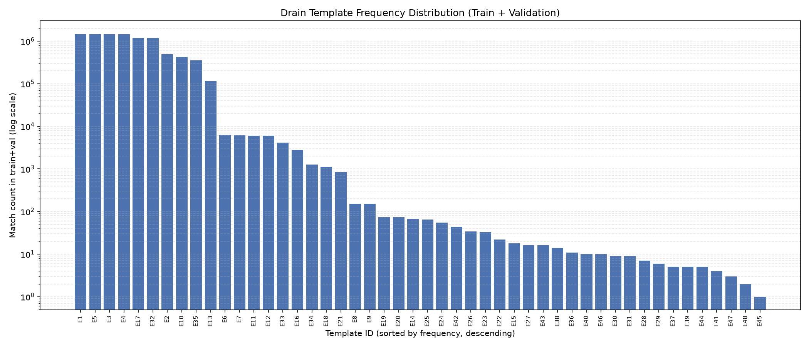
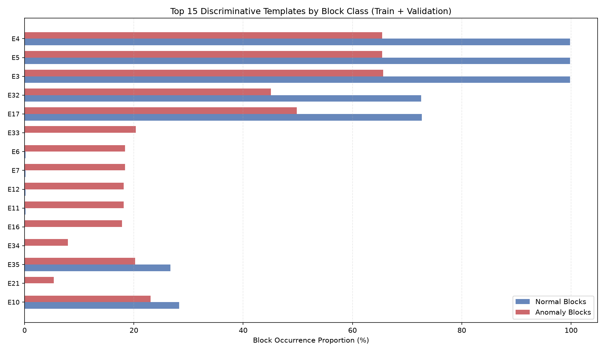
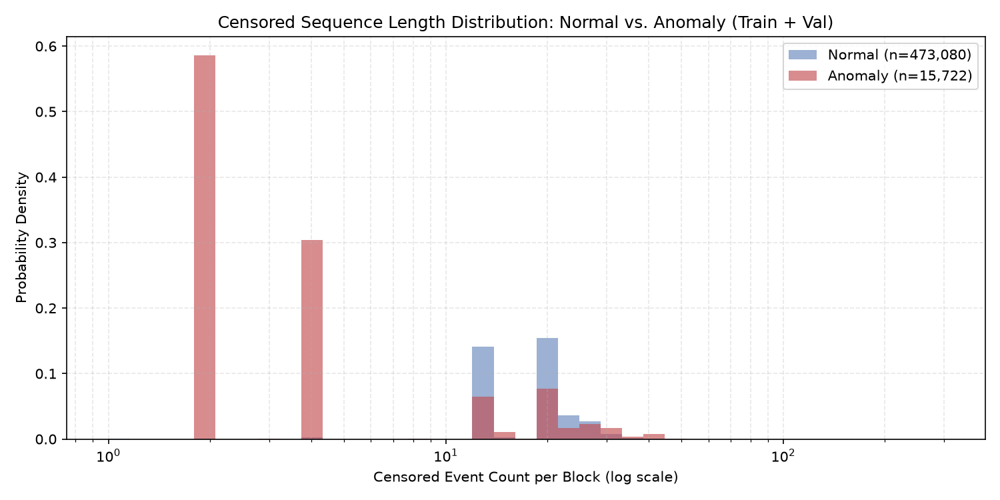
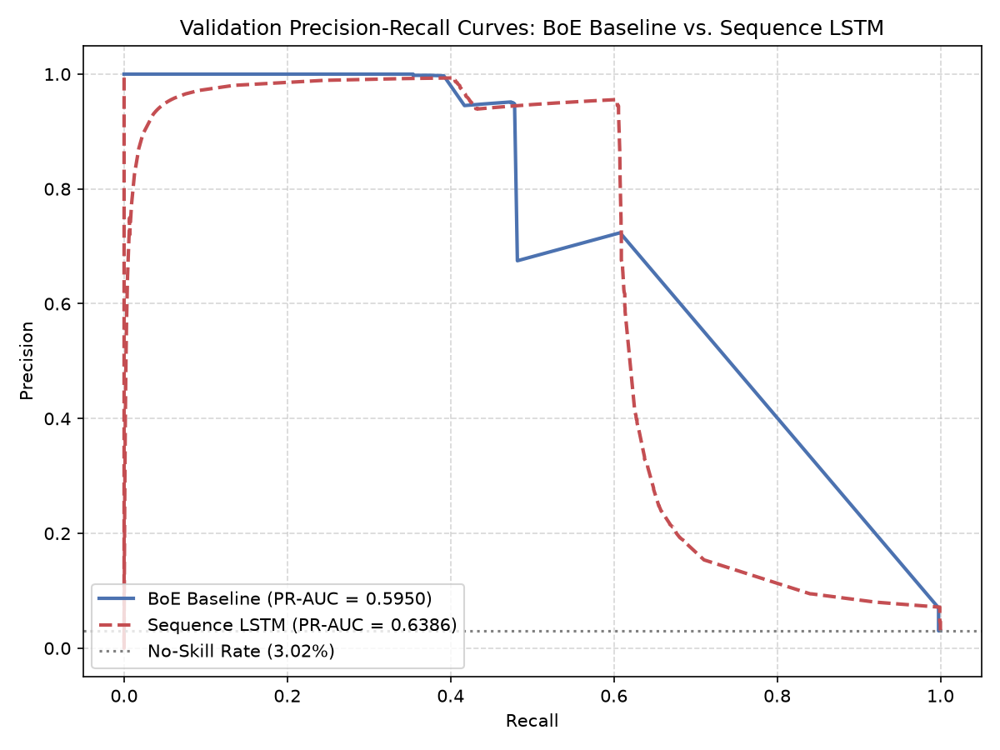
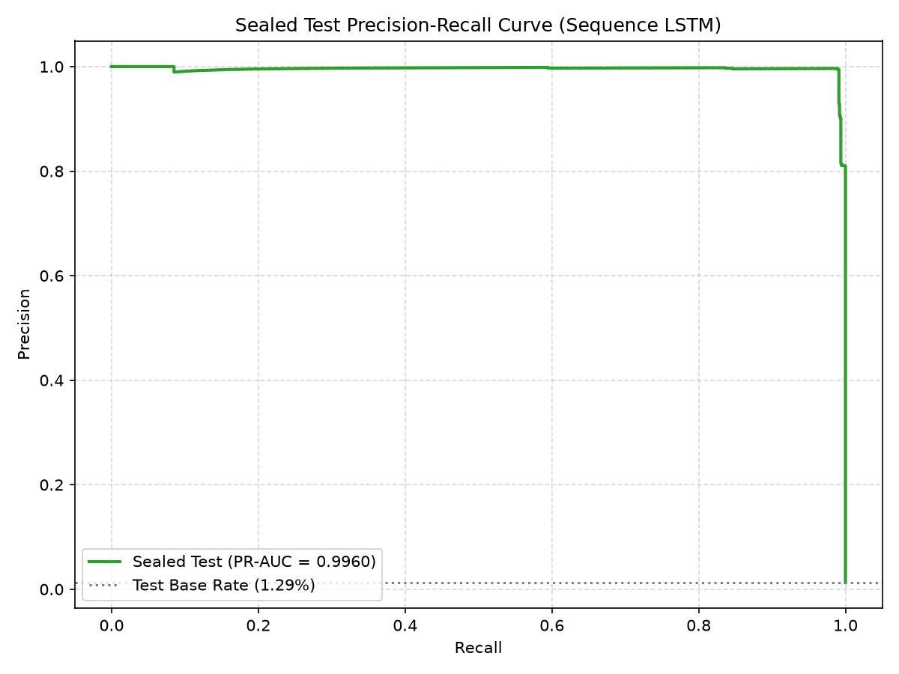

# Log Anomaly Detection on HDFS_v1: A Leakage-Aware, Sealed-Test Evaluation

## 1. Overview

This project addresses block-level anomaly detection on HDFS_v1, a widely used distributed-systems log dataset, using two representations of the same underlying event data: a bag-of-events count vector paired with a classical classifier, and an ordered event sequence paired with an LSTM. The explicit methodological aim is to determine whether preserving event order provides a measurable benefit over a simpler frequency-based representation, and to report the result honestly regardless of which direction it points.

The pipeline is built around a small number of non-negotiable disciplines carried through every phase: a chronological, leakage-free train/validation/test split; strict separation between label-blind structural audits and label-informed analysis; frozen-artifact discipline for every fitted preprocessing step (the Drain template dictionary, the LSTM's decision threshold); and a one-time, pre-registered sealed test evaluation. Every claim in this report traces back to a specific, numbered finding in one of seven notebooks (`00_calibration.ipynb` through `06_sealed_evaluation.ipynb`), each independently auditable.

## 2. Dataset and Provenance

HDFS_v1 originates from a bounded fault-injection experiment on a Hadoop test cluster (Xu et al., SOSP 2009), distributed through the Loghub collection (Zhu et al., ISSRE 2023) and obtained directly from the primary publisher source (Zenodo record 8196385, DOI 10.5281/zenodo.8196385), with archive integrity verified by MD5 checksum before extraction. The dataset comprises 11,175,629 raw log lines spanning approximately 38.7 hours, corresponding to 575,061 uniquely identifiable HDFS blocks. Of these, 16,838 (2.93%) are labeled anomalous by `anomaly_label.csv`, the original ground truth.

A calibration phase (`00_calibration.ipynb`) confirmed the raw data's structural integrity before any further processing: 100% of lines conform to the expected positional schema, no encoding corruption was detected across the full file, and the block identifier extraction procedure achieves complete coverage with a perfect one-to-one correspondence between the blocks present in the raw log and those present in the label file. Reference-only artifacts bundled with the original archive (pre-parsed event traces and template dictionaries from the original publishers) were identified as a leakage risk and quarantined outside the active data pipeline, used only for a post-hoc sanity count, never as pipeline input.

## 3. Split Design and the Censoring Problem

A chronological 70/15/15 split was adopted, but a naive line-index cutoff proved infeasible: block lifespans in this dataset are wide relative to the file (median lifespan spans approximately 9.1% of the file, maximum 62.4%), so no interior line index exists at which zero blocks are active across the boundary. The split was instead constructed as an exact block-count partition (402,543 / 86,259 / 86,259 blocks) ordered by each block's first chronological appearance.

This resolves block assignment but not event completeness: 11.28% of train blocks and 41.51% of validation blocks have events extending beyond their own split's line range. Rather than excluding these blocks — which would introduce survivor bias and misrepresent the deployment reality that a live system must score incomplete, still-active blocks — a **flag-and-retain** policy was adopted. Every block carries an explicit `is_truncated` indicator, used both as a model feature and as a mandatory stratification axis in every subsequent evaluation. Test, being the final chronological split, has a truncation rate of 0.00% by construction — a structural property, not an empirical result.

## 4. Log Parsing

Event templates were extracted using Drain (via `logparser3`), fit exclusively on the train+validation line range (9,609,369 lines) and applied as a frozen artifact to all three splits — the same fit-on-train-only discipline applied to any preprocessing step that could otherwise leak test information. Fitting discovered 48 distinct templates. A masking-correctness check confirmed block identifiers are properly treated as wildcard parameters rather than literal template content (a 0.008% template-to-block ratio). The discovered count differs from a quarantined reference count (29 templates); this gap was investigated directly via pairwise template similarity and token-level diffing rather than accepted or dismissed on assumption, and was found to reflect genuine message-type granularity — predominantly low-frequency, distinct exception-type messages — plus one documented limitation of Drain's fixed-depth tree, which cannot merge otherwise-identical messages of differing token-list length. The frozen dictionary achieved a 0.0000% out-of-vocabulary rate across all three splits, consistent with HDFS's closed, source-code-bounded logging vocabulary.

*Figure 1. Match count per discovered template (log scale), train+validation. Five templates account for the large majority of volume; the long tail of low-frequency templates is the source of the 48-vs-29 count investigated above.*

## 5. Exploratory Findings (Train and Validation Only)

Analysis in this phase was strictly scoped to train and validation; test labels were never loaded. Three findings shaped subsequent feature and modeling decisions:

- **Class-balance drift.** Train (3.26%) and validation (3.02%) anomaly rates are close to each other but both exceed the dataset-wide rate (2.93%), which — using only pre-published aggregate totals, without reading any test label — implies a test anomaly rate of approximately 1.29%, under half the train+validation rate. This label-blind prediction was later confirmed exactly at test unsealing (Section 8).
- **Completion-template absence.** Approximately one-third of Anomaly blocks show no evidence of completing their block lifecycle (missing all of the three highest-volume templates, each representing over 1.4 million train+validation events). A confound check ruled out split-boundary censoring as the cause: 99.93% of the affected blocks were fully observed, not truncated.
- **Sequence-length separation and its limits.** Anomaly blocks skew markedly shorter than Normal blocks in the lower tail, confirmed genuine (not a censoring artifact) for the same reason above. A small population of Normal blocks (777, 0.16% of all Normal blocks) were found to be true truncation artifacts whose short censored length misrepresents an otherwise very long true lifespan — flagged explicitly for feature construction rather than left to silently bias any length-based feature.

*Figure 2. Block occurrence proportion by template, Normal vs. Anomaly. The completion templates (E3, E4, E5) are near-universal in Normal blocks but absent from roughly a third of Anomaly blocks — the clearest single signal identified in this phase.*

*Figure 3. Censored event count per block (log scale), Normal vs. Anomaly. The large mass of Anomaly blocks at very low counts (~59% near count=2) reflects genuinely short lifecycles, confirmed not to be a truncation artifact.*

## 6. Feature Engineering

Both committed representations — a 49-column bag-of-events matrix and an ordered, censored template-sequence artifact — were constructed identically across all three splits from a single shared censored-event base, with `is_truncated` retained as an explicit column throughout. Labels were attached to train and validation only, in artifacts kept structurally separate from the unlabeled, all-splits feature files, with test-split label absence verified by construction rather than by inspection.

## 7. Modeling and Validation Results

A class-weighted Random Forest (bag-of-events) and a weighted-BCE LSTM (sequence, with `is_truncated` as an explicit input) were fit on train and evaluated on validation under a protocol fixed in advance: PR-AUC as the primary metric (given ~3% positive prevalence), best-F1 at a validation-optimal threshold for operational reporting, and mandatory `is_truncated`-stratified reporting.

**The LSTM outperforms the baseline on every headline metric** (PR-AUC 0.6386 vs. 0.5950; best-F1 0.7403 vs. 0.6606), and this advantage was confirmed statistically reliable via class-stratified bootstrap resampling (95% CI [+0.0341, +0.0536], excluding zero — not an arbitrary cutoff). The mechanism is precision, not recall: both models recover an almost identical fraction of true anomalies (60.4% vs. 60.8%), but the LSTM produces far fewer false positives (95.6% vs. 72.4% precision), consistent with order-sensitive information helping the model reject Normal blocks that superficially resemble anomalies under a count-only representation.

Both models' near-perfect performance on non-truncated blocks was investigated rather than reported at face value. The baseline's exact 1.0000 traced to an extremely low-cardinality, largely label-pure feature space (508 distinct fingerprints across 357,136 non-truncated rows); validation's non-truncated rows never landed on an ambiguous fingerprint, making the perfect score a mechanical consequence of feature-space structure rather than evidence of strong generalization. The LSTM's near-1.0 score (99.90% F1) rested on a richer representation (16,716 distinct sequence fingerprints), and its two validation errors traced to one genuinely novel sequence — a materially more trustworthy result.

Error analysis of the LSTM revealed a consistent pattern, confirmed across three independent checks: **errors concentrate almost entirely on truncated blocks** (99.8% of false negatives, 100% of false positives), and false negatives are confidently wrong, not borderline (median probability 0.34 against a 0.95 decision threshold; zero within 0.1 of threshold). Two further, orthogonal axes sharpen this picture: false positives are strongly tied to a rare replication-message pattern (present in 90.4% of false positives vs. 0.02% of true negatives), while false negatives uniformly lack both the completion-template and replication signals — missed anomalies are "quiet" blocks carrying none of the exception-heavy profile the model has learned to associate with the Anomaly class.

*Figure 4. Validation PR curves for both models. The shared cliff near recall 0.4-0.6 marks the transition from the non-truncated to the truncated population; the LSTM's higher precision across most of the curve is the source of its PR-AUC advantage.*

## 8. Sealed Test Evaluation

An evaluation plan — model (the LSTM), frozen decision threshold (0.9540, copied verbatim from validation), and the exact metric set — was pre-registered in writing before a single test label was loaded, and followed without deviation. Test's actual anomaly rate (1.2938%, 1,116 of 86,259 blocks) matched the label-blind prediction from Section 5 exactly, confirming the split partition introduced no arithmetic inconsistency.

The naive comparison — sealed test against overall validation — appears to show a large improvement (PR-AUC 0.9960 vs. 0.6386) but is misleading: test is 100% non-truncated by construction, while overall validation blends a near-perfect non-truncated regime with a much weaker truncated one that test does not contain. Evaluated against the correct baseline — validation's non-truncated subset — the sealed result sits close to, and consistently slightly below, validation across every metric (deltas of -0.004 to -0.008), a small, ordinary generalization gap rather than an anomalous outcome.

*Figure 5. Sealed test PR curve (Sequence LSTM). Precision erodes gradually at high recall rather than showing the sharp validation-set cliff, consistent with the absence of a truncated population in test.*

The generalization risk flagged repeatedly during modeling — untested behavior on feature configurations or sequences absent from training — was measured directly rather than left as a caveat. On test, 0.58% of blocks (502 of 86,259) carry a sequence unseen in training; performance on this minority is measurably but not catastrophically lower (PR-AUC 0.9254 vs. 1.0000 on the remainder), confirming the risk is real but small and bounded.

## 9. Limitations

- **Truncated-block behavior is validation-only evidence.** Test's truncation rate is 0.00% by construction, so the model's documented, serious weakness on truncated blocks was never exercised against sealed data. Any claim about this pipeline's handling of incomplete, still-active blocks rests on validation, not on the sealed result.
- **No sealed comparison between the two models exists.** The Random Forest baseline was deliberately never scored on test, per the pre-registered evaluation scope; its comparison to the LSTM is a validation-only finding.
- **HDFS_v1's own character bounds generalizability.** Near-perfect performance on non-truncated data, on both validation and test, was repeatedly traced to this dataset's low feature cardinality and largely deterministic structure — a documented consequence of HDFS_v1 being a small-scale, bounded fault-injection benchmark rather than organic production traffic. These results demonstrate a methodologically sound, leakage-aware pipeline; they are not evidence that this specific model would perform comparably on a less deterministic, organically-evolving log source.

## 10. Reproducibility

All stochastic operations use a fixed random seed (42). Training and inference run on CPU throughout, a deliberate choice prioritizing determinism over unverified Apple Silicon acceleration. Every fitted artifact — the Drain dictionary, both models, the frozen decision threshold — is persisted under `outputs/` and `data/interim/`, and every notebook's `Findings` sections document the exact evidence, including two cases where an initial implementation defect (a block-ID event double-count in the split-boundary audit; an unpersisted lifespan artifact) was caught, corrected, and recorded rather than silently fixed. The full notebook sequence, `00_calibration.ipynb` through `06_sealed_evaluation.ipynb`, constitutes the complete, auditable record behind every figure in this report.
